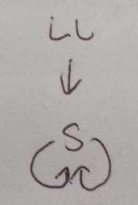
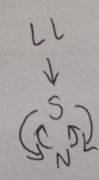
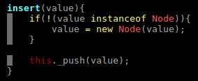
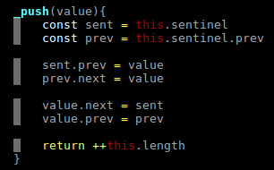
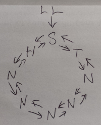
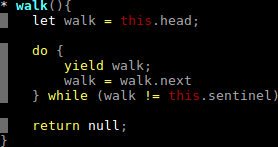
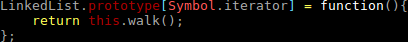
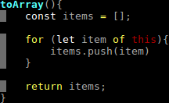
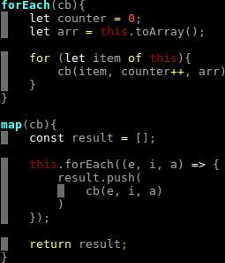
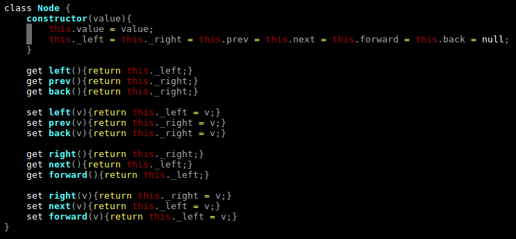

# dumlru

A dumb implementation of an LRU

## What's an LRU?

It's an acronym that stands for Least Recently Used. When people say LRU they're usually talking about a Least Recently Used cache, although the concept of frequency is used in other places, like Firefox's [frecency algorithm](https://developer.mozilla.org/en-US/docs/Mozilla/Tech/Places/Frecency_algorithm)

An LRU is a data structure made by combining a linked list and a hash. It's a data structure made out of data structures! 

"Yo dawg, we heard you like data structures, so we put data structures in your data structures so you can structure your data in data structures while you structure your data in a data structure"

It uses a linked list sorted such that the most recently used item is at the head of the list, while the least recently used item is at the tail of the list. Whenever an item is accessed, its node in the linked list is placed in the front of the list.

Simultaneouslty there is a map whose values contain pointers to the nodes in the linked list. There's one node per pointer and vice versa, and they point to eachother.

The hash is used to access items with O(n) time; upon access, the LRU moves the associated node in the linked list to the head of the linked list.

When inserting a new item into the hash, the item is also inserted into the linked list. If the linked list grows beyond its length constraint, the tail of the list, along with its associated entry in the hash, is deleted. In this manner we can set a max length for the LRU - whenever the LRU would exceed this length, the oldest item in the LRU is deleted.

## The Linked List

I've chosen to use a doubly-linked linked list implementation using a sentinel node. Why? Because it's what seemed easiest on this fine Sunday afternoon. Here's some pictures of it!

### Upon instantiation:

The new linked list instance only has a sentinel node. Its length is 0 even though it has a node. That's because the sentinel node is special; it's not an element of this container, rather it's there to make other operations easier. The sentinel node's next and previous pointers point to itself, instead of having values like NULL. All code in the Linked List will know that iterating the nodes terminates when the current node, or the next node in the iterable sequence, is or points to the sentinel node. Iteration starts and ends with the sentinel node, rather than, for example, NULL.

### Upon adding an item:

When adding an item, simply update the sentinel node's previous and next pointers. Update the inserted item's previous and next pointers to point to the right things too. Here's the code for that:

Insert wraps around _push, ensuring only Nodes get inserted. By making the sentinel node's next and previous point to itself, the same code can be used for inserting the first element into the list as for any subsequent elements. The sentinel node removes the need to add branching statements.

### Upon adding multiple items:

The Linked List instance may look like this:

## Iterating the Linked List

You want to walk through the linked list while your current node's next pointer doesn't equal the sentinel node? Baka, this is 2018! We have [iterators](https://developer.mozilla.org/en-US/docs/Web/JavaScript/Guide/Iterators_and_Generators)! This took a little fineggeling. First, there needs to be a generator. Or rather, a generator function that returns an iterable object. Or something.

This walk generator's returned iterator can be assigned to the Linked List class' `Symbol.iterator` property, thus allowing iteration of an instance of a Linked List:

I chose to do this outside of the new Class syntax because I couldn't figure out how to do it outside of the constructor's body, which would create a different function for every instance of a Linked List. Assigning the walk method to Symbol.iterator lets the programmer perform the following magic:

Notice the code is literally iterating `this`. That's the magic of Symbol.iterator!

I think it's fun to implement common array methods in my own data structure implementations, so here's some more:

## A note on Inconsistent Naming

I didn't put much work into naming; when making linked lists, I generally just think of queues and stacks, plus all the pointer logic from lists and trees. The result is a jumble. Sometime's it's easier for me to think about these things with "next" and "prev", other times it's easier to reason with "left" and "right". Luckily, Ecmascript's getter/setter notation lets me be inconsistent with my naming!

Obviously this would never fly in the workplace
